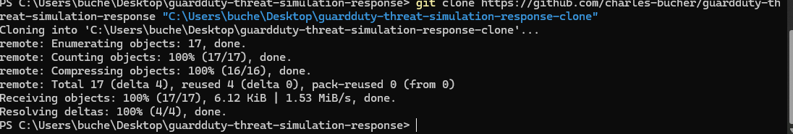
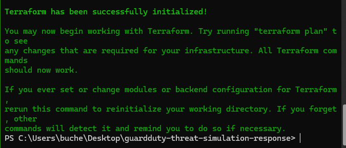
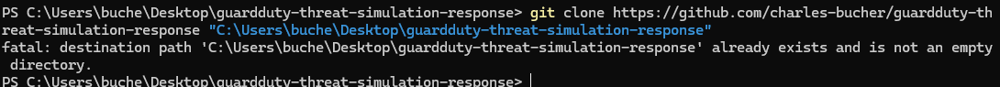
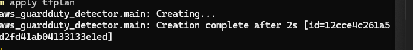
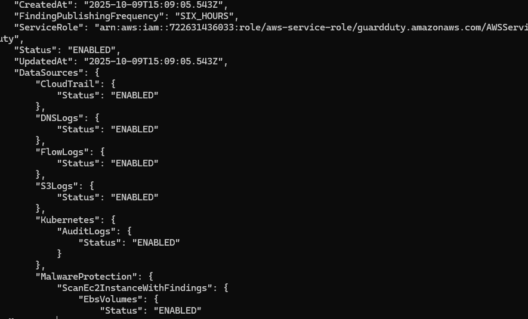
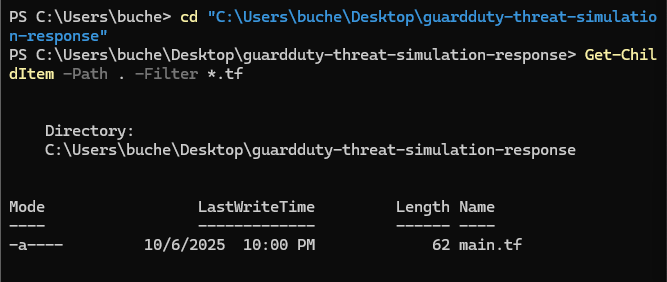
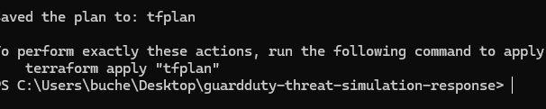
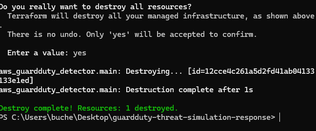

# GuardDuty Threat Simulation & Response

Automated AWS GuardDuty Threat Simulation & Response — Terraform-based lab that deploys GuardDuty, simulates security findings, and triggers automated incident response workflows. Includes scripts, screenshots, and cleanup automation for cloud security practice and demonstrations.

---

## Project Walkthrough

### 1. Clone Repository

### 2. Initialization

### 3. Deployment

### 4. Terraform Configuration

### 5. Cleanup & Destroy

---

## Technologies Used
- AWS GuardDuty
- Terraform
- AWS CLI
- Python/Bash scripting

## Setup Instructions
1. Clone this repository
2. Configure AWS credentials
3. Run `terraform init`
4. Run `terraform apply`
5. Execute threat simulation scripts
6. Review GuardDuty findings
7. Run `terraform destroy` for cleanup
